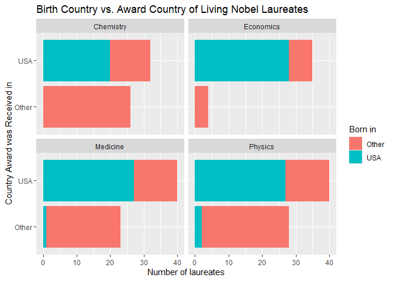

Lab 03 - Nobel laureates
================
Graham Overheu
1/29/2026

### Load packages and data

``` r
library(tidyverse) 
```

``` r
nobel <- read_csv("data/nobel.csv")
```

## Exercises

### Exercise 1

There are 935 observations and 26 variables. Each row represents one
individual Nobel Prize given out to the winner.

### Exercise 2

``` r
nobel_living <- nobel %>% 
  filter(
    is.na(died_date),
    !is.na(country),
    gender != "org"
  )
```

There are 228 observations in the data set.

### Exercise 3

``` r
nobel_living <- nobel_living %>%
  mutate(
    country_us = if_else(country == "USA", "USA", "Other")
  )
```

The graph below shows that for every science category, the majority of
Nobel Prize winners were based in the USA when they won the award,
particularly for the field of economics.

### Exercise 4

``` r
# fyi you haven't made nobel_living_science yet
sum(nobel_living$born_country_us == "USA")
```

    ## Warning: Unknown or uninitialised column: `born_country_us`.

    ## [1] 0

The total number of laureates that were born in the US is 105.

### Exercise 5

``` r
nobel_living <- nobel_living %>%
  mutate(
    born_country_other = if_else(born_country == "USA", "USA", "Other")
  )
```

``` r
ggplot(nobel_living, aes(x = country_us, fill = born_country_other)) +
  geom_bar() +
  facet_wrap(~ category) +
  coord_flip() +
  labs(
    x = "Country Award was Received in",
    y = "Number of laureates",
    fill = "Born in",
    title = "Birth Country vs. Award Country of Living Nobel Laureates"
  )
```

<!-- -->

Yes, the graph supports BuzzFeed’s claim that of those US-based Nobel
laureates, many of them were born in other countries. While there
weren’t many compared to the number of those who were born in the US, it
can still be said that a reasonable amount of them were not born in the
US; for instance, for medicine, the number of laureates who received the
award in the USA but were born in a different country takes up around
25-30% of the “USA” bar.

### Exercise 6

``` r
nobel_living %>%
  filter(country == "USA", born_country != "USA") %>%
  count(born_country, sort = TRUE)
```

    ## # A tibble: 21 × 2
    ##    born_country       n
    ##    <chr>          <int>
    ##  1 Germany            7
    ##  2 United Kingdom     7
    ##  3 China              5
    ##  4 Canada             4
    ##  5 Japan              3
    ##  6 Australia          2
    ##  7 Israel             2
    ##  8 Norway             2
    ##  9 Austria            1
    ## 10 Finland            1
    ## # ℹ 11 more rows

Germany and the United Kingdom are the most common countries.
